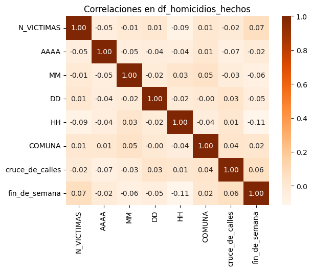
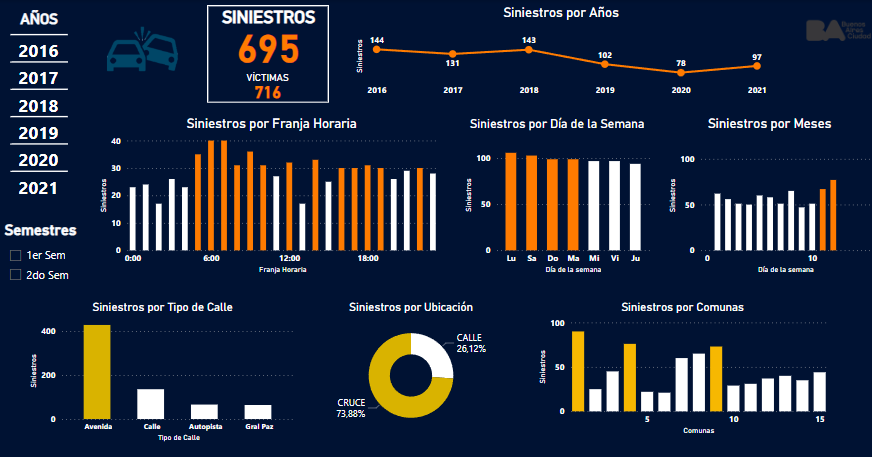
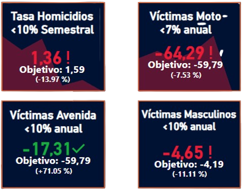

 

  <h1 align="center">PROYECTO INDIVIDUAL Nº2</h1>
  
  <h1 align="center">Data Analyst. Siniestros Viales en Buenos Aires.</h1>

</body>

 

  

## **Descripción y Contexto**

El Observatorio de Movilidad y Seguridad Vial (OMSV), centro de estudios que se encuentra bajo la órbita de la Secretaría de Transporte del Gobierno de la Ciudad Autónoma de Buenos Aires, solicita la elaboración de un proyecto de análisis de datos, con el fin de generar información que le permita a las autoridades locales tomar medidas para disminuir la cantidad de víctimas fatales de los siniestros viales. 

El Observatorio fue creado por la Ley 4511/2013. Es un centro de estudios de alta eficiencia y nivel técnico que tiene como objetivo sistematizar y analizar información para comprender la situación actual en materia de seguridad vial en la Ciudad. Desde 2020 se amplió su campo de acción, incluyendo la elaboración de informes y reportes relativos a la Movilidad en la Ciudad.

El Observatorio de Movilidad y Seguridad Vial de la Ciudad de Buenos Aires (OMSV) toma como su principal fuente de información datos policiales, tal y como recomiendan los estándares internacionales. Las estadísticas elaboradas se realizan en base a los sumarios que instruye la Policía de la Ciudad ante dos clases de delitos que involucran la seguridad vial: lesiones culposas y homicidios culposos.

En Argentina, aproximadamente 4.000 personas fallecen cada año en accidentes de tráfico. A pesar de los esfuerzos realizados en muchas jurisdicciones para reducir la cantidad de estos incidentes, siguen siendo la principal causa de muertes violentas en el país. Según los informes del Sistema Nacional de Información Criminal (SNIC) del Ministerio de Seguridad de la Nación, entre 2018 y 2022 se registraron 19.630 muertes en siniestros viales en todo el país. Estas cifras equivalen a un promedio de 11 víctimas fatales diarias debido a accidentes de tráfico.

## **Datasets**

Los archivos para iniciar el trabajo se descargaron de la página [Buenos Aires Data](https://data.buenosaires.gob.ar/dataset/victimas-siniestros-viales), son de uso público y se encuentran en formato Excel:

- ***Homicidios (XLSX):*** Información sobre homicidios en siniestros viales ocurridos en la Ciudad desde el año 2016 hasta el 2021. Los datos incluyen fecha y ubicación del hecho y tipo de transporte involucrado.

- ***Lesiones (XLSX):*** Información sobre las lesiones en siniestros viales ocurridos en la Ciudad desde el año 2019 hasta el 2021. Los datos incluyen fecha y ubicación del hecho y tipo de transporte involucrado.

Además se pueden descargar los siguientes archivos auxiliares en formato pdf:

- ***NOTAS HOMICIDIOS SINIESTRO VIAL:*** Es un documento guía relacionado que contiene información sobre Bases de Víctimas Fatales en Siniestros Viales. Notas para su uso.

- ***NOTAS LESIONES SINIESTRO VIAL:*** Es un documento guía relacionado que contiene información sobre Bases de Lesiones en Siniestros Viales. Notas para su uso.

## **Tecnologías utilizadas**

Para la realización del proyecto se utilizó Python, NumPy, Pandas, Matplotlib y Seaborn en un notebook de Google Colaboratory para desarrollar los procesos de Análisis Exploratorio de los Datos (EDA) y para la Extracción, Transformación y Carga de los mismos (ETL). La visualización de los análisis y resultados se realizó en un dashboard interactivo utilizando Power BI.

 
   

     

## **Análisis Exploratorio de los Datos (EDA) y Extracción, Transformación y Carga (ETL)**

Para realizar el EDA y el ETL se importaron las librerías necesarias como Pandas, NumPy, Matplotlib y Seaborn.

**Archivo: Homicidios_HECHOS**

Primeramente se cargó el conjunto de datos desde el archivo "homicidios.xlsx" en la pestaña 'HECHOS' y se exploró su información básica, como el tamaño del DataFrame, la presencia de datos nulos y las principales estadísticas descriptivas de las variables numéricas (Media, Desviación Estándar, Valor máximo, Valor mínimo, etc.). En este punto, se proporcionaron conclusiones sobre el dataset, como la cantidad de años cubiertos, la distribución de las víctimas por siniestro y la distribución de siniestros por año, mes, franja horaria y comuna. 

Se llegó a la conclusión que este dataset tiene 21 columnas y 696 filas. Se observa que las columnas 'Altura' y 'Cruce' son las que mas datos nulos presentan, lo cual se explorará en detalle más adelante. Los siniestros registrados en el dataframe abarcan un periodo de 6 años desde 2016 hasta 2021. Las víctimas por accidentes van desde 1 hasta 3 con una media de 1.03 víctimas por siniestro y los mismos han sido registrados en todos los años del periodo analizado, durante todos los meses, en todas las franjas horarias y en todas las comunas de la ciudad, es decir, en este sentido no hay excepciones en la ocurrencia de los mismos.

Se identificaron y manejaron los valores nulos en las columnas más relevantes, como "Altura" y "Cruce", mediante estrategias como la imputación de valores o la eliminación de columnas innecesarias. Se modificaron los tipos de variables según fue necesario y acorde al tipo de datos que representan.

Posteriormente se analizaron variables específicas, como el tipo de movilidad de las víctimas y los acusados, la frecuencia de siniestros por tipo de calle y la relación entre variables como la fecha del siniestro y la cantidad de víctimas.

Se examinaron las correlaciones entre diferentes variables, como la relación entre el día de la semana y el número de víctimas, y se presentaron las correlaciones en una matriz de calor.

 

 

Finalmente se realizaron ajustes en los nombres de las columnas resultantes para estandarizar los mismos y facilitar la comprensión y el análisis de los datos.

**Archivo: Homicidios_VICTIMAS**

Se cargaron los datos desde el mismo archivo Excel, pero en esta ocasión específicamente desde la pestaña 'VICTIMAS' para realizar la exploración del resto de la información proporcionada.

Se mostraron las primeras filas del DataFrame y se exploraron los datos nulos y los tipos de datos presentes. Se observó que este dataset tiene 10 columnas y 717 filas, y se comparó con el otro dataset relacionado con los HECHOS, evidenciando que el número de filas es mayor en el dataset de víctimas debido a la posibilidad de múltiples víctimas por hecho. Se analizaron los registros de fecha y se mencionó que hay valores duplicados de 'ID' debido a múltiples víctimas en un mismo incidente.

Se contabilizaron y verificaron los valores duplicados en el DataFrame, y se comprobó que no existían valores faltantes en la columna 'ID_hecho'. Se identificaron y corrigieron los valores nulos en la columna 'EDAD', transformando su tipo de dato a numérico y realizando una imputación de datos faltantes basada en la media de las edades por sexo.

 

 

Las edades de entre 20 y 45 años son las que tienen la mayor frecuencia de víctimas. Se puede analizar que las personas en este rango de edad suelen estar en un período de mayor actividad social y profesional, lo que significa que pasan más tiempo en la carretera debido al trabajo, estudio, actividades recreativas, etc. Los adultos jóvenes a menudo participan en comportamientos de riesgo en la carretera.

Se graficaron además las frecuencias de los roles en el siniestro y los sexos de las víctimas, destacando las tendencias observadas y las posibles interpretaciones detrás de ellas.

Posteriormente se examinaron posibles valores atípicos en la columna 'EDAD' y 'NUMERO DE VICTIMAS' por incidente. No se encontraron valores atípicos.

 

 

En este archivo también se estandarizaron los nombres de las columnas para asegurar consistencia y claridad en el análisis.

**Unión de ambos archivos en un solo Dataset.**

Para unir ambos archivos, se eliminaron las columnas duplicadas entre los datasets de víctimas y hechos para facilitar la fusión de ambos conjuntos de datos y no conservar información repetida ni redundante.

Por último, se fusionaron los datasets de HECHOS y VICTIMAS en un único DataFrame llamado ['df_siniestros'](https://drive.google.com/file/d/1-3vQStmvA8VabDYbSNWOTuGKf-spPSU4/view?usp=sharing) utilizando la columna 'Id_siniestro' como clave de unión y el mismo se exportó como un archivo CSV para su posterior uso y análisis.

Este proceso de EDA y ETL proporciona una comprensión del conjunto de datos y establece una base sólida para análisis más avanzados y visualización de datos con un dataset limpio y transformado para generar informes fiables y de calidad.

El notebook fue realizado en Google Colaboratory y se puede consultar en el repositorio o en el siguiente [enlace](https://colab.research.google.com/drive/1O0ZZ89CkxYTywOkcALzFG3pYsZboXGSK?usp=sharing).

## **Visualización de los Datos**

Se realizó un dashboard de Power BI para la visualización interactiva de los resultados, facilitando el análisis intuitivo y la toma de decisiones informadas, el cual se puede consultar en el repositorio.

 

## **Medición de indicadores mediante KPIs**

Los KPIs (Indicadores Claves de Desempeño) evaluan el progreso hacia los objetivos de una organización, estos indicadores proporcionn una visión rápida y clara del rendimiento de una empresa en relación con sus metas estratégicas, , por lo que son cruciales para el seguimiento del desempeño y la toma de decisiones.

En el proyecto se plantearon tres objetivos (KPIs) en función de lograr la disminución de la cantidad de víctimas fatales y ocurrencia de siniestros viales, los cuales fueron propuestos luego de analizar minusiosamente los datos proporcionados.

- **KPI Nro. 1:** Reducir en un 10% la tasa de homicidios en siniestros viales de los últimos seis meses en comparación con la tasa de homicidios del semestre anterior. Se definió la tasa de homicidios como: 

 
(Número de homicidios en siniestros viales / Población total) * 100,000

- **KPI Nro. 2:** Reducir en un 7% la cantidad de accidentes mortales de motociclistas en el último año con respecto al año anterior. Este indicador se definió como: 

 
(Número de accidentes mortales con víctimas en moto en el año anterior - Número de accidentes mortales con víctimas en moto en el año actual) / (Número de accidentes mortales con víctimas en moto en el año anterior) * 100

- **KPI Nro. 3:** Reducir en un 10% la cantidad de accidentes mortales ocurridos en avenidas en el último año con respecto al año anterior. Este indicador se definió como: 

 
(Número de accidentes mortales ocurridos en avenidas en el año anterior - Número de accidentes mortales ocurridos en avenidas en el año actual) / (Número de accidentes mortales ocurridos en avenidas en el año anterior) * 100

- **KPI Nro. 4:** Reducir en un 10% la cantidad de víctimas del sexo masculino en el último año con respecto al año anterior. Este indicador se definió como: 

 
(Cantidad de víctimas del sexo masculino en el año anterior - Cantidad de víctimas del sexo masculino en el año actual) / (Cantidad de víctimas del sexo masculino en el año anterior) * 100

Como Población Total se tomó el dataset: [Proyecciones de población por sexo y grupos quinquenales de edad. Ciudad Autónoma de Buenos Aires. Años 2010-2040](https://www.estadisticaciudad.gob.ar/eyc/?p=29329) de la página de [Buenos Aires](https://buenosaires.gob.ar/inicio/), el mismo se cargó directamente desde la web a Power BI y allí se transformaron los datos para ser usado en la visualización.

 

 

## **Conclusiones y Recomendaciones**

Entre los años registrados en los datasets, 2016 a 2021, se registraron en total 695 siniestros viales, los cuales provocaron 716 víctimas fatales, de las cuales 544 fueron del sexo masculino (76.62%) y 166 del sexo femenino (23.38%). El grupo de edades de mayor riesgos fue entre los 25 y 45 años. 

Los meses de Noviembre y Diciembre resultaron con el mayor número de siniestros en el período analizado. En relación al tipo de movilidad de las víctimas fatales en accidentes, el mayor riesgo lo tienen los motociclistas con un 42.04%, seguidos de los peatones con un 37.15% y en tercer lugar los conductores de autos que representaron el 12.85%. Estos indicadores se pueden analizar teniendo en cuenta que tanto los peatones como los motociclistas están más expuestos al entorno en comparación con los ocupantes de vehículos cerrados como automóviles, ya que tienen mucha menos protección que los ocupantes de vehículos (cinturones de seguridad, airbags y carrocería).  

El 61.73% de los siniestros ocurrió en las avenidas de la ciudad, siendo el tipo de vía con mayor riesgo de que ocurra un accidente de tránsito. Además del total de accidentes, el 73.88% ocurrió en un cruce de calles y el 26.12% sucedió en las inmediaciones de la cuadra, representando las esquinas los puntos en los que existe mas probabilidades de ocurrencia de accidentes. Se puede comentar en este sentido que las esquinas suelen ser puntos de confluencia de diferentes flujos de tráfico, ya sea vehículos que cambian de dirección, peatones cruzando la calle o ciclistas compartiendo la vía, en estas intersecciones los conductores pueden tener su visibilidad reducida debido a obstáculos como edificios, árboles, postes de luz u otros vehículos estacionados, esta combinación aumenta la probabilidad de que ocurra un siniestro vial.

Tomando en cuenta el último año para el análisis de los KPIs para el segundo semestre del año 2021, no se cumplió con el objetivo de disminuir la tasa de homicidios en siniestros viales en un 10%, tampoco se logró reducir un 7% la cantidad de víctimas mortales en motos en comparación con el año anterior ni reducir en un 10% la cantidad de accidentes de personas del sexo masculino, en cambio, comparando igualmente 2021 con 2020, si se logró disminuir en un 10% la ocurrencia de accidentes en avenidas, lo que resultó en un aumento en seguridad al transitar por este tipo de vía.

En función de los resultados y análisis realizados, se hacen las siguientes recomendaciones:

- Continuar monitoreando los objetivos propuestos (KPIs) en los próximos periodos de tiempo, acompañados de campañas de prevención, fundamentalmente enfocadas en los conductores de motos y los usuarios de las avenidas.

- Realizar jornadas de educación vial en lugares públicos de alta confluencia de personas dentro de la ciudad y enfocar en ellas tanto a conductores como a peatones, los cuales, como se vio en el informe, son el segundo grupo de mayor riesgo.

- Aumentar las campañas de seguridad vial entre los días viernes y lunes, y realizar una intensificación de las mismas en diciembre que es el mes de mayor ocurrencia de accidentes.

## Autor:  Duniet Marrero García  

  
   
  
  

